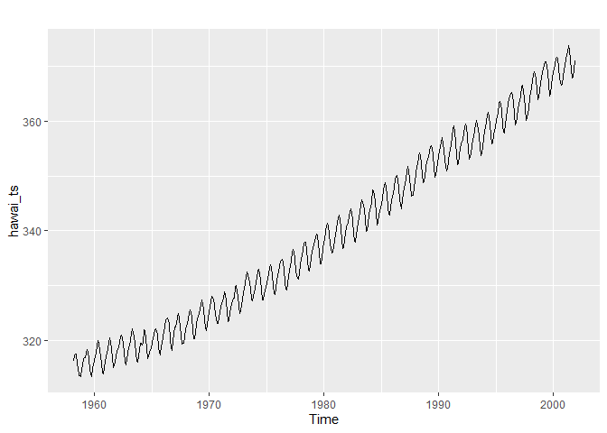

Séries temporelles et reproductibilité
================
Paz Elizabeth Alvarez
29/07/2020

``` r
##------------------------------------------------------------------------------
##--------Bibliotéques----------------------------------------------------------
library(ggplot2)
library(dplyr)
```

    ## 
    ## Attaching package: 'dplyr'

    ## The following objects are masked from 'package:stats':
    ## 
    ##     filter, lag

    ## The following objects are masked from 'package:base':
    ## 
    ##     intersect, setdiff, setequal, union

``` r
library(tidyverse)
```

    ## -- Attaching packages ----------------------------------------------------------------------------------------------- tidyverse 1.3.0 --

    ## v tibble  3.0.1     v purrr   0.3.4
    ## v tidyr   1.1.0     v stringr 1.4.0
    ## v readr   1.3.1     v forcats 0.5.0

    ## -- Conflicts -------------------------------------------------------------------------------------------------- tidyverse_conflicts() --
    ## x dplyr::filter() masks stats::filter()
    ## x dplyr::lag()    masks stats::lag()

``` r
library(lubridate)
```

    ## 
    ## Attaching package: 'lubridate'

    ## The following objects are masked from 'package:base':
    ## 
    ##     date, intersect, setdiff, union

``` r
library(tibble)
library(readr)
library(purrr)
library(stringr)
library(forcats)
library(fpp2)
```

    ## Warning: package 'fpp2' was built under R version 4.0.2

    ## Loading required package: forecast

    ## Warning: package 'forecast' was built under R version 4.0.2

    ## Registered S3 method overwritten by 'quantmod':
    ##   method            from
    ##   as.zoo.data.frame zoo

    ## Loading required package: fma

    ## Warning: package 'fma' was built under R version 4.0.2

    ## Loading required package: expsmooth

    ## Warning: package 'expsmooth' was built under R version 4.0.2

``` r
library(cowplot)
```

    ## Warning: package 'cowplot' was built under R version 4.0.2

    ## 
    ## ********************************************************

    ## Note: As of version 1.0.0, cowplot does not change the

    ##   default ggplot2 theme anymore. To recover the previous

    ##   behavior, execute:
    ##   theme_set(theme_cowplot())

    ## ********************************************************

    ## 
    ## Attaching package: 'cowplot'

    ## The following object is masked from 'package:lubridate':
    ## 
    ##     stamp

``` r
library(e1071)
```

    ## Warning: package 'e1071' was built under R version 4.0.2

``` r
##---------Donnês---------------------------------------------------------------
hawai <- read.csv("C:/data/hawai.csv")

##---------Il Devient les données de la colonne "time" en format "Date" --------
hawai$time = date_decimal(hawai$time, tz = "UTC")
hawai$time = as.Date(hawai$time)
hawai$time <- ymd(hawai$time)
```

``` r
##---------Il graphique toutes les données par années, mois et jours------------
hawai %>%
  mutate(Year = time %>% year(),
         Month = time %>% month(),
         YearMonth = ymd(paste0(Year, "-", Month, "-01"))) %>%
  filter(Year >= 1958 & Year < 2002) %>%
  group_by(Year, YearMonth) %>%
  dplyr::summarise(CO2 = mean(CO2, na.rm = TRUE)) %>%
  ggplot(aes(x=YearMonth, y=CO2)) +
  facet_wrap(~Year, scales = "free_x", ncol = 4) +
  geom_line() +
  expand_limits(y = 0)
```

    ## `summarise()` regrouping output by 'Year' (override with `.groups` argument)

<!-- -->

``` r
##---1. créer une série temporelle du CO2 à partir des données de hawai.csv-----
##--------------Il devient les données en format "Time series"------------------
hawai_ts <- ts(hawai %>% dplyr::select(-time),
               start = c(hawai$time[1] %>% year(), 3),
               frequency = 12)

window(hawai_ts)
```

    ##           Jan      Feb      Mar      Apr      May      Jun      Jul      Aug
    ## 1958                   316.1000 317.2000 317.4333 317.4333 315.6250 314.9500
    ## 1959 315.5000 316.7000 316.7333 317.6750 318.3250 318.0250 316.5250 314.9000
    ## 1960 316.3800 316.9750 317.5750 319.1200 319.9250 319.4500 318.0600 315.7750
    ## 1961 316.9250 317.6500 318.5250 319.4200 320.4750 319.7500 318.3200 316.7750
    ## 1962 317.9250 318.6250 319.6800 320.5500 320.9000 320.5000 319.4250 317.7333
    ## 1963 318.7250 318.9667 319.8600 321.2750 322.1000 321.4600 319.6000 317.6000
    ## 1964 319.4000 319.4000 319.1000 319.4000 322.0000 321.7500 320.3000 318.5000
    ## 1965 319.4000 320.4500 320.9250 322.0000 322.0600 321.7750 321.0400 318.7250
    ## 1966 320.5400 321.5750 322.3750 323.6600 324.0250 323.7000 322.8500 320.2000
    ## 1967 322.4000 322.4250 323.0000 324.2800 324.9500 324.0750 322.4800 320.8500
    ## 1968 322.5500 323.0500 323.9200 324.9750 325.4750 325.2600 324.0250 321.9400
    ## 1969 323.9250 324.2750 325.6000 326.5750 327.2800 326.5500 325.8000 323.5400
    ## 1970 325.0800 326.0250 327.0000 328.0750 327.9200 327.5500 326.3000 324.6600
    ## 1971 326.1400 326.6500 327.2000 327.6750 328.8200 328.4750 327.2200 325.2500
    ## 1972 326.7200 327.6250 327.7250 329.6400 330.0000 329.0750 328.0400 326.2500
    ## 1973 328.5500 329.4750 330.3800 331.5750 332.4000 331.9400 330.6500 329.3250
    ## 1974 329.3250 330.6250 331.5000 332.6250 332.9750 332.1600 331.0750 329.2200
    ## 1975 330.2500 331.3000 332.0000 333.2750 333.8600 333.4000 331.8000 329.9800
    ## 1976 331.7400 332.5500 333.4500 334.4500 334.7600 334.4000 332.8600 330.7250
    ## 1977 332.8800 333.4250 334.7000 336.0400 336.6750 336.2000 334.8000 332.8750
    ## 1978 335.0250 335.3500 336.6000 337.6400 337.9500 337.9250 336.5000 334.6500
    ## 1979 336.2250 336.7000 338.0000 338.8750 339.3750 339.2400 337.5250 336.0250
    ## 1980 337.9250 338.2250 340.0600 340.7500 341.3400 340.9500 339.3750 337.6000
    ## 1981 339.2200 340.4500 341.4000 342.4500 342.8200 342.1250 340.4250 338.4000
    ## 1982 340.7000 341.5500 342.6750 343.4750 343.9600 343.3000 341.9200 339.6250
    ## 1983 341.3400 342.5000 343.1500 344.9000 345.6500 345.2750 343.8200 342.1500
    ## 1984 343.6750 344.4250 345.1750 347.4000 347.3500 346.6600 345.2000 343.3000
    ## 1985 344.9250 345.8750 347.4400 348.3250 348.8250 348.1800 346.4500 344.3000
    ## 1986 346.2500 346.8250 347.7400 349.5250 350.0800 349.3750 347.8250 345.8200
    ## 1987 348.0000 348.5000 349.4750 350.8500 351.7400 351.1500 349.4500 348.0800
    ## 1988 350.4000 351.7750 352.1250 353.5800 354.1750 353.7500 352.2200 350.3000
    ## 1989 352.7750 353.0000 353.6000 355.3600 355.6000 355.1250 353.8600 351.5750
    ## 1990 353.6500 354.6500 355.4800 356.1750 357.0750 356.0800 354.6750 352.9000
    ## 1991 354.6750 355.6500 357.2000 358.6000 359.2500 358.1800 356.0500 353.8600
    ## 1992 355.9000 356.6800 357.9000 359.0750 359.5400 359.1250 357.0000 354.8600
    ## 1993 356.6800 357.1750 358.4250 359.3250 360.1800 359.5000 357.4200 355.3250
    ## 1994 358.3200 358.9000 359.9250 361.2200 361.6500 360.9000 359.4600 357.3750
    ## 1995 359.9750 360.9250 361.5750 363.3600 363.7000 363.2500 361.8000 359.3750
    ## 1996 362.0250 363.1750 364.0600 364.7000 365.3250 364.8800 363.4750 361.3200
    ## 1997 363.1250 363.8750 364.5600 366.3250 366.6800 365.4750 364.3750 362.4600
    ## 1998 365.3400 366.2000 367.3750 368.5250 369.1400 368.7500 367.6000 365.7200
    ## 1999 368.1200 368.8500 369.6000 370.9750 370.8400 370.2500 369.0000 366.7000
    ## 2000 369.0200 369.3750 370.4000 371.5400 371.6500 371.6250 369.9400 367.9500
    ## 2001 370.1750 371.3250 372.0600 372.7750 373.8000 373.0600 371.3000 369.4250
    ##           Sep      Oct      Nov      Dec
    ## 1958 313.5000 313.5000 313.4250 314.7000
    ## 1959 313.8250 313.4000 314.8750 315.5250
    ## 1960 314.1750 313.8400 315.0250 316.2000
    ## 1961 315.0400 315.3500 316.0500 316.9800
    ## 1962 316.0667 315.4750 316.5500 317.5250
    ## 1963 316.1500 316.0500 317.0000 318.3500
    ## 1964 316.6000 316.9600 317.7250 318.6750
    ## 1965 317.8250 317.3400 318.8750 319.3250
    ## 1966 318.7000 318.1800 319.9000 321.0600
    ## 1967 319.3000 319.4500 320.6750 321.9200
    ## 1968 320.2500 320.2750 321.3200 322.9250
    ## 1969 322.4000 321.8000 322.8200 324.1250
    ## 1970 323.1500 323.1400 324.0500 325.1000
    ## 1971 323.4000 323.5400 324.8250 325.9250
    ## 1972 324.8600 325.3000 326.4250 327.5400
    ## 1973 327.5000 327.2250 328.0500 328.6400
    ## 1974 327.3750 327.3750 328.4000 329.6750
    ## 1975 328.5250 328.3250 329.4400 330.7750
    ## 1976 329.3500 329.1000 330.3500 331.6250
    ## 1977 331.5750 331.2000 332.3500 333.8600
    ## 1978 332.7400 332.6500 333.8250 334.9600
    ## 1979 333.9800 333.9500 335.1500 336.6600
    ## 1980 335.8750 336.0250 337.0600 338.2000
    ## 1981 336.7000 336.9400 338.4250 339.6000
    ## 1982 338.0250 337.9000 339.2750 340.4250
    ## 1983 339.8750 340.0200 341.1500 342.9800
    ## 1984 341.1200 341.4750 342.8500 344.1400
    ## 1985 343.0000 342.8000 344.2200 345.5750
    ## 1986 344.8000 344.1000 345.6200 346.8750
    ## 1987 346.4000 346.4400 347.9250 348.9250
    ## 1988 348.7500 348.9600 350.0000 351.3600
    ## 1989 349.8600 350.0500 351.2000 352.4800
    ## 1990 350.9400 351.2250 352.7000 354.1400
    ## 1991 352.1250 352.2500 353.7400 355.0250
    ## 1992 353.0250 353.4200 354.2000 355.3500
    ## 1993 353.7750 354.0600 355.3500 356.7750
    ## 1994 355.9250 356.0200 357.5750 359.0600
    ## 1995 358.0000 357.8500 359.4750 360.7000
    ## 1996 359.4000 359.6250 360.7400 362.3750
    ## 1997 360.1500 360.7500 362.3800 364.2500
    ## 1998 363.9250 364.3200 365.5500 366.9250
    ## 1999 364.6750 365.1400 366.6500 367.9000
    ## 2000 366.5400 366.7250 368.1250 369.4400
    ## 2001 367.8800 368.0500 369.3750 371.0200

``` r
##---------------Il fait la graphique temporelle -------------------------------
autoplot(hawai_ts)
```

<!-- -->

``` r
##-------------Il fait les graphiques pour les series temporelles---------------
ggA <- ggseasonplot(window(hawai_ts)) + ggtitle("")
ggB <- ggseasonplot(window(hawai_ts), polar = TRUE) + ggtitle("")
ggC <- ggsubseriesplot(window(hawai_ts), polar = TRUE) + ggtitle("") + labs(y="Flow")
plot_grid(ggA, ggB, ggC, ncol = 3, labels = c("A", "B", "C"))
```

<!-- -->

``` r
##-------------Il fait la graphique d'autocorrélation --------------------------
ggAcf(hawai_ts, ci = 0.95) + ggtitle("Hawai-CO2: Autocorrélation")
```

<!-- -->

``` r
Box.test(hawai_ts, lag = 20, type = "Ljung-Box")
```

    ## 
    ##  Box-Ljung test
    ## 
    ## data:  hawai_ts
    ## X-squared = 9325.2, df = 20, p-value < 2.2e-16

``` r
## 2. séparer la série en parties d'entraînement (environ 70% des données) et en partie test
##------------Separation de données de Test et d'entraînement-------------------
hawai_ts_train <- window(hawai_ts, start = 1958, end = 1988.99)##  70% de données.
```

    ## Warning in window.default(x, ...): 'start' value not changed

``` r
hawai_ts_test <- window(hawai_ts, start = 1989)## 30% de données.
```

``` r
## 3. créer un modèle prévisionnel sur les données d'entraînement, puis projeter 
## la prévision de CO2 atmosphérique pour comparer aux données test ------------
##----------Modèle prévisionnel "Snaive"----------------------------------------
hm_naive <- snaive(hawai_ts_train, h = 24)
autoplot(hm_naive) +
  autolayer(fitted(hm_naive)) +
  autolayer(hawai_ts_test, color = "green") +
  labs(x = "Année", y = "CO2")
```

    ## Warning: Removed 12 row(s) containing missing values (geom_path).

<!-- -->

``` r
##----------Precision de modéle prévisionnel------------------------------------
accuracy(hm_naive, hawai_ts)
```

    ##                    ME     RMSE      MAE       MPE      MAPE     MASE      ACF1
    ## Training set 1.204828 1.381214 1.227277 0.3607868 0.3677864 1.000000 0.7626342
    ## Test set     2.057708 2.181601 2.057708 0.5815549 0.5815549 1.676646 0.6514169
    ##              Theil's U
    ## Training set        NA
    ## Test set      1.754403

``` r
##---------Prévision du modéle "Holt-Winters" ----------------------------------
hawai_hw <- hw(hawai_ts_train, damped = TRUE, h = 100, seasonal = "additive")
autoplot(hawai_hw) + autolayer(fitted(hawai_hw))+
  autolayer(hawai_ts_test, color = "green")
```

<!-- -->

``` r
##---------Prévision du modéle "ARIMA" -----------------------------------------
hawai_arima <- hawai_ts_train %>% auto.arima()
hawai_arima %>% forecast(h = 50) %>% autoplot()+
  autolayer(hawai_ts_test, color = "red")
```

<!-- -->

``` r
summary(hawai_arima)
```

    ## Series: . 
    ## ARIMA(1,1,1)(2,1,2)[12] 
    ## 
    ## Coefficients:
    ##          ar1      ma1     sar1     sar2     sma1     sma2
    ##       0.3554  -0.7241  -0.2349  -0.1690  -0.5919  -0.1612
    ## s.e.  0.0969   0.0706   0.3221   0.0674   0.3243   0.2811
    ## 
    ## sigma^2 estimated as 0.1146:  log likelihood=-118.82
    ## AIC=251.64   AICc=251.96   BIC=278.79
    ## 
    ## Training set error measures:
    ##                      ME      RMSE       MAE         MPE       MAPE      MASE
    ## Training set 0.03148463 0.3297152 0.2532262 0.009219152 0.07684692 0.2063318
    ##                     ACF1
    ## Training set -0.01364102

``` r
hawai_arima2 <- hawai_ts_train %>% auto.arima(lambda = 0)
hawai_arima2 %>% forecast(h = 200) %>% autoplot()+
  autolayer(hawai_ts_test, color = "red")
```

<!-- -->

``` r
##  4. effectuer une analyse des résidus  
##--------Modéle pour obtenir les residuals --------------------------------------
checkresiduals(hm_naive)
```

<!-- -->

    ## 
    ##  Ljung-Box test
    ## 
    ## data:  Residuals from Seasonal naive method
    ## Q* = 961.21, df = 24, p-value < 2.2e-16
    ## 
    ## Model df: 0.   Total lags used: 24

``` r
shapiro.test(residuals(hm_naive)) # non-normal si p-value < seuil (0.05)
```

    ## 
    ##  Shapiro-Wilk normality test
    ## 
    ## data:  residuals(hm_naive)
    ## W = 0.99042, p-value = 0.01964

``` r
kurtosis(residuals(hm_naive), na.rm = TRUE) # le résultat d'un test de kurtosis sur une distribution normale devrait être de 0.
```

    ## [1] 0.9174297
